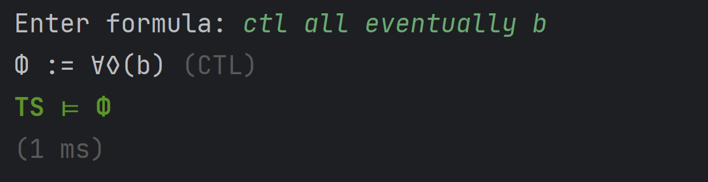
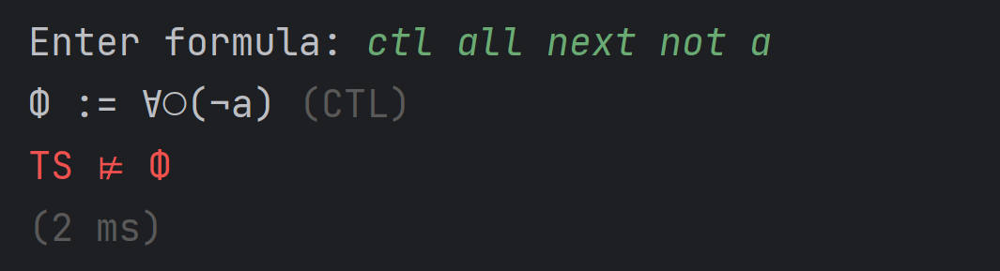
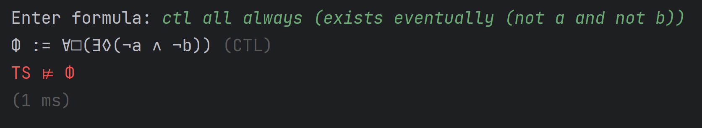

# Model Checking
This project is a practice environment for implementing algorithms related to model checking.
The techniques used here are used here are introduced in the RWTH Aachen University lecture 'Model Checking' by [Prof. Dr. Ir. Dr. h. c. Joost-Pieter Katoen](https://moves.rwth-aachen.de/people/katoen/) 
and can be read up in the book [Principles of Model Checking](https://mitpress.mit.edu/9780262026499/principles-of-model-checking/) by Christel Baier and Joost-Pieter Katoen.

Model checking is a technique used to formally verify whether a given system model satisfies a desired property or specification. In this project, model checking algorithms are implemented to analyze transition systems.

## How to build and run the project
Clone the git repository: <br> 
``git clone https://github.com/paultristanwagner/model-checking.git`` <br>
Navigate into the created directory: <br>
``cd model-checking`` <br> 
Let Gradle build the project (Use the Gradle wrapper as shown here or install Gradle >= 8.1.1): <br>
``./gradlew jar`` <br>
Run the project: <br>
``java -jar build/libs/model-checking-1.0-SNAPSHOT.jar`` <br>
Now you should see the command line asking you to specify a file defining a transition system.

## Transition systems
A transition system is a tuple (S, Act, T, I, AP, L) where S is a set of states, Act is a set of actions, T is a transition relation, I is a set of initial states, AP is a set of atomic propositions and L is a labeling function that assigns a subset of the atomic propositions to each state.
In this project, transition systems can be defined in files in json format.
(For simplicity, the set of actions is not needed for now.)
Example: See examples/ts0.json
```
{
	"states": ["s0","s1","s2","s3","s4"],
	"transitions": [
		["s0","s1"],
		["s1","s2"],
		["s2","s3"],
		["s3","s3"],
		["s3","s0"],
		["s0","s4"],
		["s4","s4"]
	],
	"initialStates": ["s0","s3"],
	"atomicPropositions": ["a","b"],
	"labelingFunction": {
		"s0": [],
		"s1": ["a"],
		"s2": ["a","b"],
		"s3": ["b"],
		"s4": ["b"]
	}
}
```

 <br>

### Load a transition system from a file
To load a transition system from a file, enter the path to the file in the command line. <br>
Example: <br>


## LTL: Linear Temporal Logic
[Linear Temporal Logic (LTL)](https://en.wikipedia.org/wiki/Linear_temporal_logic) is a modal temporal logic used for reasoning about the behavior of systems over time. It provides a formal language for expressing properties and conditions that hold in the future of paths or sequences of events. LTL allows us to describe assertions such as "a condition will eventually be true" or "a condition will hold until another fact becomes true.
Example LTL formulas:
- □(safe) - "The system is always in a safe state"
- ◇(response) - "At some point in the future, the system will respond to a request"
- ◇□(a) - "At some point in the future, the system will always be in a state where a is true"

## CTL: Computation Tree Logic
[Computation Tree Logic (CTL)](https://en.wikipedia.org/wiki/Computation_tree_logic) is a formal logic used for specifying and verifying properties of concurrent and reactive systems. It stands out among other temporal logics due to its branching-time nature, which allows for modeling and reasoning about systems where multiple alternative paths and future outcomes are possible. In CTL, the notion of time is represented as a tree-like structure, reflecting the non-deterministic nature of system behavior. This tree encompasses different branches, each corresponding to a distinct possible future path that the system may take.
Example CTL formulas:
- ∃◇(error) - "There exists a way for the system to reach an error state"
- ∀◇(error) - "For all possible ways the system can evolve, there exists a way to reach an error state"
- ∀□(∃◇(reset)) - "For all possible ways the system can evolve, it is always possible to reset the system"

## Model checking of LTL and CTL formulas
In this project, model checking algorithms for LTL as well as CTL formulas are implemented.
A simple parser is used to parse LTL and CTL formulas based on a flexible grammar.

### Examples of LTL model checking
We can check LTL properties for the previously shown transition system defined in ``examples/ts0.json``: <br>

φ := □(a) - "The system is always in a state where a is true" <br>
 <br>
Explanation: The formula does not hold for the transition system because there exists a path starting in s0 that leads to s4 where a is already initially false.

φ := ◇(b) - "At some point in the future, the system will be in a state where b is true" <br>
 <br>
Explanation: The formula holds for the transition system because every path of the transition system must visit either s3 or s4.

φ := ◇□(a) - "From some point in the future, the system will always be in a state where a is true" <br>
 <br>
Explanation: The formula does not hold for the transition system because there exists a path starting in s0 that leads to s4 where it stays forever. And a does not hold in s4.

### Examples of CTL model checking
We can check CTL properties for the previously shown transition system defined in ``examples/ts0.json``: <br>

Φ := ∀◊(b) - "For all possible ways the system can evolve, there exists a way to reach a state where b is true" <br>
 <br>
Explanation: The formula holds for the transition system because every path in the transition system must visit either s3 or s4.

Φ := ∀◯(¬a) - "For all possible ways the system can evolve the next state will not be a"
 <br>
Explanation: The formula does not hold for the transition system because there exists a path starting in s0 that leads to s1 where a is true.

Φ := ∀□(∃◊(¬a ∧ ¬b)) - "For all possible ways the system can evolve, it is always possible to reach a state where a and b are false" <br>
 <br>
Explanation: The formula does not hold for the transition system because for the path starting in s0 going to s4, it is not possible anymore to reach a state where a and b are false.

## Comparison of LTL and CTL
CTL and LTL have distinct characteristics and expressiveness, making them incomparable in terms of their expressive power. CTL focuses on reasoning about paths in a computation tree and allows for the specification of temporal properties that hold on all or some of the paths. On the other hand, LTL deals with linear sequences of states and enables the specification of temporal properties that hold along all possible executions. Although they serve different purposes, CTL and LTL can complement each other in the context of model checking, as they provide different perspectives and approaches to reasoning about temporal properties in concurrent systems.

The computational complexity of model checking for Linear Temporal Logic (LTL) and Computation Tree Logic (CTL) differs, with LTL model checking being PSPACE-complete and CTL model checking being PTIME-complete. While it might seem that CTL model checking is more efficient due to its PTIME complexity, it is important to note that the length of the formula plays a significant role. In many cases, LTL formulas can be exponentially shorter than their CTL equivalents. This means that even though CTL model checking has a better complexity class, the actual runtime can be influenced by the size of the formula. Therefore, the efficiency of model checking depends not only on the computational complexity class but also on the specific properties being checked and the lengths of the corresponding formulas in LTL and CTL.

## Contributing
Thank you for your interest in contributing to this project! Contributions are welcome and greatly appreciated. 

## Feedback and Troubleshooting
If you have any feedback or encounter any issues, please open an issue on GitHub or E-Mail me at: [paultristanwagner@gmail.com](mailto:paultristanwagner@gmail.com).

## Ideas for future work
- Write tests for the CTL and LTL model checking algorithms
- Optimize the lookup of the next states in the transition system
- Implement linear-time fixpoint computation in CTL model checking
- Implication and equivalence operators in CTL and LTL grammar
- Parser for ω-regular expressions
